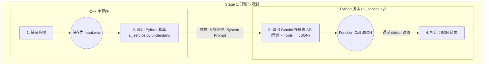
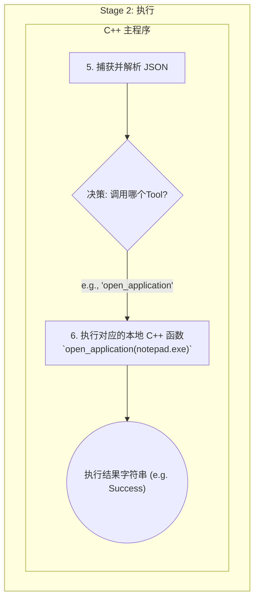
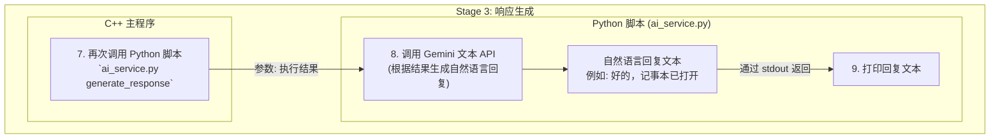
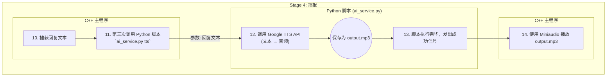

```mermaid
graph TD

    %% 阶段 1: 理解与规划 (Understand & Plan)
    subgraph "Stage 1: 理解与规划"
        subgraph "C++ 主程序"
            B[1. 捕获音频]:::cpp --> C((保存为 input.wav)):::data;
            C --> D["2. 调用 Python 脚本<br/>`ai_service.py understand`"]:::cpp;
        end
        
        subgraph "Python 脚本 (ai_service.py)"
            D -- "参数: 音频路径, System Prompt" --> E["3. 调用 Gemini 多模态 API\n(音频 + Tools → JSON)"]:::python
            E --> F((Function Call JSON)):::data;
            F -- "通过 stdout 返回" --> G[4. 打印 JSON 结果];
        end
    end
```

```mermaid
graph TB
    %% 阶段 2: 执行 (Execute)
   subgraph "Stage 2: 执行"
        subgraph "C++ 主程序"
            H[5. 捕获并解析 JSON]:::cpp;
            H --> I{决策: 调用哪个Tool?};
            I -- "e.g., 'open_application'" --> J["6. 执行对应的本地 C++ 函数\n`open_application(notepad.exe)`"]:::cpp
            J --> K(("执行结果字符串 (e.g. Success)")):::data
        end
    end
```

```mermaid
graph TD
    %% 阶段 3: 响应生成 (Generate Response)
    subgraph "Stage 3: 响应生成"
        subgraph "C++ 主程序"
            L["7. 再次调用 Python 脚本<br/>`ai_service.py generate_response`"]:::cpp;
        end
        
        subgraph "Python 脚本 (ai_service.py)"
            L -- "参数: 执行结果" --> M["8. 调用 Gemini 文本 API\n(根据结果生成自然语言回复)"]:::python
            M --> N["自然语言回复文本\n例如: 好的，记事本已打开"]:::data
            N -- "通过 stdout 返回" --> O[9. 打印回复文本];
        end
    end
```

```mermaid
graph TD

  %% 阶段 4: 播报 (Speak)
    subgraph "Stage 4: 播报"
        subgraph "C++ 主程序"
            P[10. 捕获回复文本]:::cpp;
            P --> Q["11. 第三次调用 Python 脚本<br/>`ai_service.py tts`"]:::cpp;
        end
        
        subgraph "Python 脚本 (ai_service.py)"
            Q -- "参数: 回复文本" --> R["12. 调用 Google TTS API\n(文本 → 音频)"]:::python
            R --> S((保存为 output.mp3)):::data;
            S --> T[13. 脚本执行完毕，发出成功信号];
        end

        subgraph "C++ 主程序"
            T --> U[14. 使用 Miniaudio 播放 output.mp3]:::cpp;
        end
    end
    
```