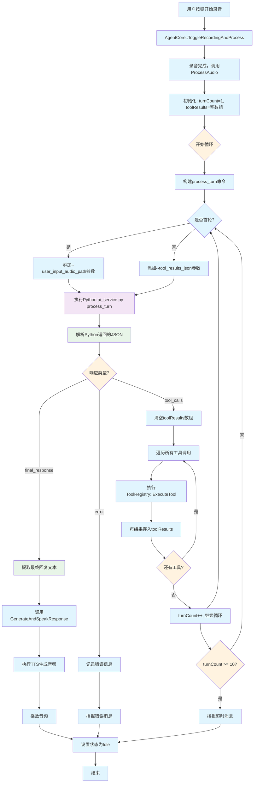

# 重构后的多轮对话流程图

## 新的Agent循环架构

## 关键改进点

### 1. 统一的循环架构
- **单一入口**: 所有对话轮次都通过 `process_turn` 命令处理
- **状态管理**: 使用 `toolResults` 数组维护对话历史
- **循环控制**: 基于Python响应类型决定是否继续循环

### 2. 多工具支持
- **并行执行**: 单轮可以执行多个工具
- **结果聚合**: 所有工具结果统一存储和传递
- **依赖处理**: 后续轮次可以使用前面工具的结果

### 3. 智能决策
- **工具调用**: 模型决定需要调用哪些工具
- **任务完成**: 模型判断何时生成最终回复
- **错误恢复**: 完善的错误处理和用户反馈

### 4. 安全机制
- **循环限制**: 最多10轮对话防止无限循环
- **异常处理**: 多层次的错误捕获和处理
- **状态恢复**: 错误时自动返回Idle状态

## 示例场景：复杂任务执行

**用户请求**: "获取当前时间，写入桌面文件"

### 第1轮
- **输入**: 用户音频
- **Python返回**: `{"tool_calls": [{"name": "get_current_time", "args": {}}, {"name": "get_known_folder_path", "args": {"folder_name": "desktop"}}]}`
- **C++执行**: 并行执行两个工具
- **结果**: `[{"tool_name": "get_current_time", "content": "2025-10-22 10:30:00"}, {"tool_name": "get_known_folder_path", "content": "C:/Users/User/Desktop"}]`

### 第2轮
- **输入**: 上轮工具结果
- **Python返回**: `{"tool_calls": [{"name": "write_to_file", "args": {"path": "C:/Users/User/Desktop/time.txt", "content": "当前时间：2025-10-22 10:30:00"}}]}`
- **C++执行**: 写入文件
- **结果**: `[{"tool_name": "write_to_file", "content": "Success: 文件已写入"}]`

### 第3轮
- **输入**: 写入文件结果
- **Python返回**: `{"final_response": "好的，我已经获取了当前时间并保存到您的桌面文件中。"}`
- **C++执行**: TTS播报，循环结束

这个新架构完全支持复杂任务的分解执行，实现了真正的Agent式工作流程。