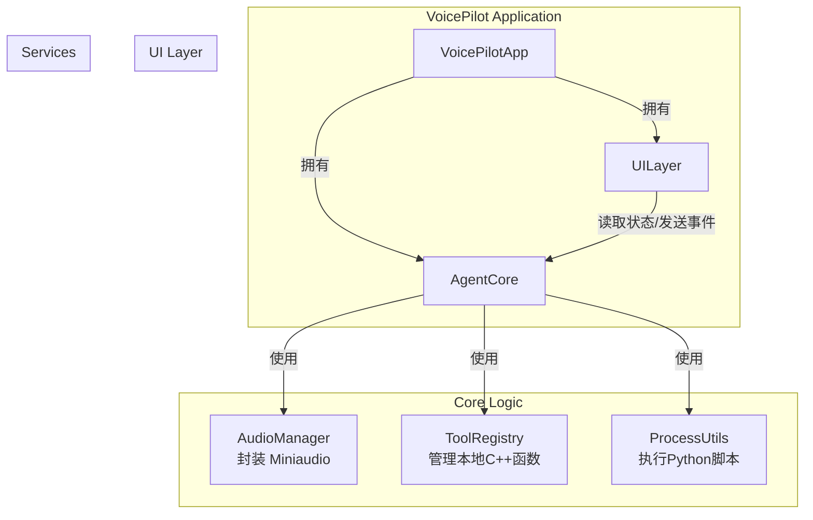

```mermaid
graph TD
    subgraph "VoicePilot Application"
        A[VoicePilotApp] -- "拥有" --> B;
        A -- "拥有" --> C;
    end

    subgraph "Core Logic"
        B[AgentCore] -- "使用" --> D;
        B -- "使用" --> E;
        B -- "使用" --> F;
    end
    
    subgraph "UI Layer"
        C[UILayer] -- "读取状态/发送事件" --> B;
    end

    subgraph Services
        D[AudioManager<br>封装 Miniaudio]
        E[ToolRegistry<br>管理本地C++函数]
        F[ProcessUtils<br>执行Python脚本]
    end
```