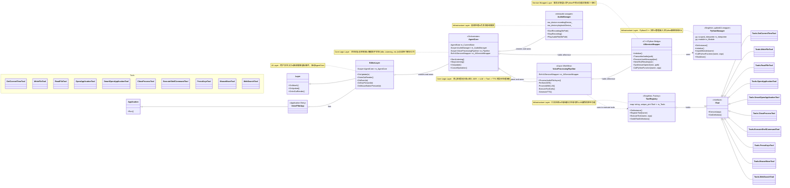

```mermaid
classDiagram
    direction LR

    class Application {
        +Run()
    }

    class VoicePilotApp {
        <<Application Entry>>
    }
    Application <|-- VoicePilotApp

    class Layer {
        +OnAttach()
        +OnUpdate()
        +OnImGuiRender()
    }

    class EditorLayer {
        -Scope~AgentCore~ m_AgentCore
        +OnUpdate(ts)
        +OnImGuiRender()
        +OnEvent(e)
        -OnKeyPressed(e)
        -OnMouseButtonPressed(e)
    }
    Layer <|-- EditorLayer
    VoicePilotApp o-- EditorLayer : has

    class AgentCore {
        <<Orchestrator>>
        -AgentState m_CurrentState
        -Scope~AudioManager~ m_AudioManager
        -Scope~VoiceProcessingPipeline~ m_Pipeline
        -Ref~AIServiceWrapper~ m_AIServiceWrapper
        +StartListening()
        +StopListening()
        +OnUpdate()
        +CancelOperation()
    }
    EditorLayer o-- AgentCore : creates and owns

    class VoiceProcessingPipeline {
        <<Async Workflow>>
        -Ref~AIServiceWrapper~ m_AIServiceWrapper
        +ProcessAudioFileAsync()
        -PerformASR()
        -ProcessWithLLM()
        -ExecuteToolCalls()
        -GenerateTTS()
    }
    AgentCore o-- VoiceProcessingPipeline : creates and owns

    class AudioManager {
        <<miniaudio wrapper>>
        -ma_device recordingDevice_
        -ma_device playbackDevice_
        +StartRecording(filePath)
        +StopRecording()
        +PlayAudioFile(filePath)
    }
    AgentCore o-- AudioManager : creates and owns

    class AIServiceWrapper {
        <<C++/Python Bridge>>
        +Initialize()
        +TranscribeAudio(path)
        +ProcessUserMessage(text)
        +SendToolResults(json)
        +SynthesizeSpeech(text, path)
        -CallPythonFunction(name, args)
    }
    AgentCore o-- AIServiceWrapper : holds reference
    VoiceProcessingPipeline o-- AIServiceWrapper : holds reference
    
    class PythonManager {
        <<Singleton, pybind11 wrapper>>
        -py::scoped_interpreter m_Interpreter
        -py::module m_Module
        +GetInstance()
        +Initialize()
        +ImportModule(name)
        +CallPythonFunction(name, args)
        +Shutdown()
    }
    AIServiceWrapper ..> PythonManager : uses

    class ITool {
        <<Interface>>
        +Execute(args)
        +GetDefinition()
    }

    class ToolRegistry {
        <<Singleton, Factory>>
        -map~string, unique_ptr~ITool~~ m_Tools
        +GetInstance()
        +RegisterTool(name)
        +ExecuteTool(name, args)
        +GetAllToolDefinitions()
    }
    VoiceProcessingPipeline ..> ToolRegistry : uses to execute tools
    ToolRegistry o-- "many" ITool : holds

    namespace Tools {
        class GetCurrentTimeTool
        class WriteFileTool
        class ReadFileTool
        class OpenApplicationTool
        class SmartOpenApplicationTool
        class CloseProcessTool
        class ExecuteShellCommandTool
        class PressKeysTool
        class MouseMoveTool
        class WebSearchTool
    }
    ITool <|-- Tools.GetCurrentTimeTool
    ITool <|-- Tools.WriteFileTool
    ITool <|-- Tools.ReadFileTool
    ITool <|-- Tools.OpenApplicationTool
    ITool <|-- Tools.SmartOpenApplicationTool
    ITool <|-- Tools.CloseProcessTool
    ITool <|-- Tools.ExecuteShellCommandTool
    ITool <|-- Tools.PressKeysTool
    ITool <|-- Tools.MouseMoveTool
    ITool <|-- Tools.WebSearchTool

    note for EditorLayer "UI Layer - 用户交互入口\n接收键盘/鼠标事件，驱动AgentCore"
    note for AgentCore "Core Logic Layer - 状态机与总控制器\n管理助手状态 (Idle, Listening, etc.)\n协调各个模块工作"
    note for VoiceProcessingPipeline "Core Logic Layer - 核心处理流水线\n定义 ASR -> LLM -> Tool -> TTS 的异步处理流程"
    note for AIServiceWrapper "Service Wrapper Layer - 服务封装层\n将Python中的AI功能封装成C++接口"
    note for PythonManager "Infrastructure Layer - Python/C++ 交互\n管理嵌入式Python解释器和GIL"
    note for AudioManager "Infrastructure Layer - 音频处理\n负责录音和播放"
    note for ToolRegistry "Infrastructure Layer - 工具系统\n注册和执行所有可供LLM使用的原生功能"
```